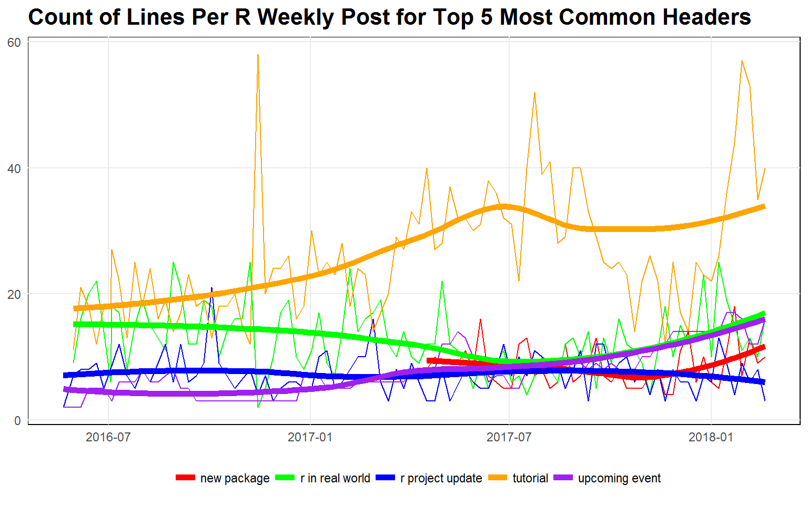

# Introduction

See my [blog post](https://tonyelhabr.rbind.io/posts/tidy-text-analysis-rweekly/)
for a full write-up, or, check out the `.html` file in the `output/` directory
in this repo, which was used as the basis for the blog post.
The `figs/` directory also contains all of the visualizations in the post.

# Highlights

Here are a couple of the coolest visualization, in my opinion.

